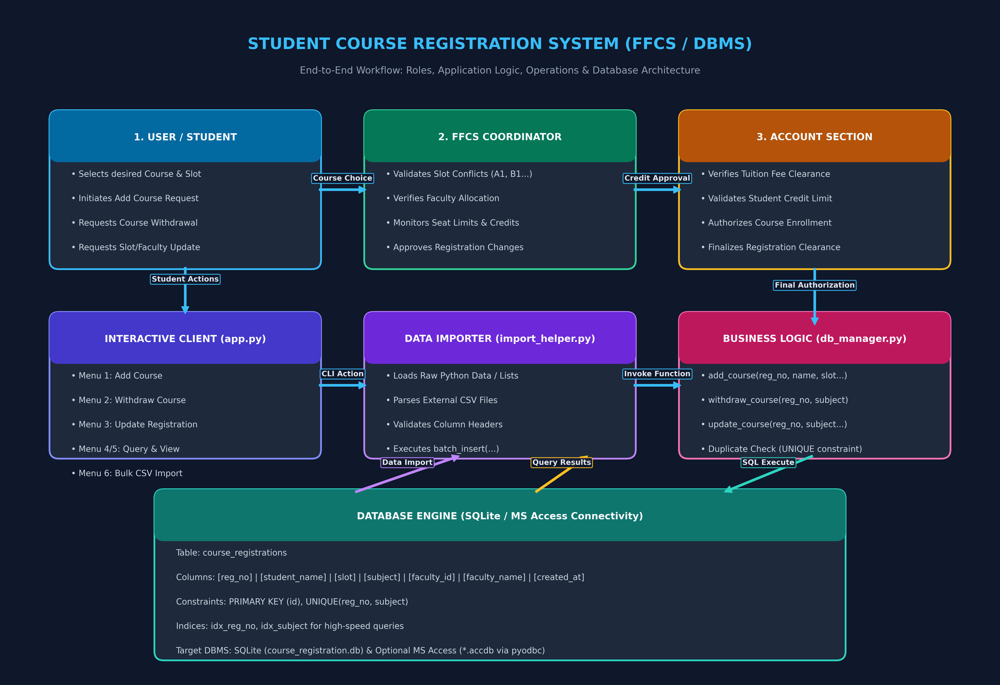

# Student Course Registration DBMS

A complete SQL database management system connected to Python, implementing the whiteboard specifications for student course registration (FFCS).



> 📖 **Full Architectural & Flowchart Documentation**: See [WORKFLOW.md](WORKFLOW.md) for detailed sequence diagrams, Mermaid flowcharts, and role workflows.

## Table Structure
Matches the whiteboard columns:
- **`reg_no`**: Student Registration Number (e.g. `21BCE1001`)
- **`student_name`**: Student Name (e.g. `Aarav Sharma`)
- **`slot`**: Timetable Slot (e.g. `A1+TA1`)
- **`subject`**: Subject / Course Name (e.g. `Database Management Systems`)
- **`faculty_id`**: Faculty ID (e.g. `FAC101`)
- **`faculty_name`**: Faculty Name (e.g. `Dr. Ramesh Kumar`)

---

## Implemented Functions (Bottom-Left on Whiteboard)
1. **`add_course(reg_no, student_name, slot, subject, faculty_id, faculty_name)`**:
   - Registers a student for a course.
   - Enforces unique constraint per student & subject to prevent duplicate registrations.
2. **`withdraw_course(reg_no, subject)`**:
   - Drops an enrolled course for a given student registration number and subject.
3. **`update_course(reg_no, subject, new_slot=..., new_faculty_id=..., ...)`**:
   - Modifies slot, faculty, or course information for an existing registration.
4. **`get_courses_by_student(reg_no)`**:
   - Retrieves all courses registered by a student.
5. **`get_all_registrations()`**:
   - Fetches all records across all students.
6. **`batch_insert(records)`**:
   - Fast bulk importer for student datasets.

---

## File Structure
- `db_manager.py`: Core database operations & SQL queries.
- `app.py`: Interactive terminal-based menu for testing and managing records.
- `import_helper.py`: Ready-to-use script to plug in your custom dataset (via Python list/dict or CSV).
- `schema.sql`: Raw SQL schema definition.
- `test_db.py`: Automated test suite.

---

## How to Run

### 1. Interactive Menu
To launch the CLI application:
```bash
python app.py
```

### 2. Run Automated Tests
```bash
python test_db.py
```

### 3. Load Your Data
You can load data in two simple ways:

#### Option A: Edit `import_helper.py`
Open `import_helper.py`, paste your rows into `sample_data`:
```python
sample_data = [
    {
        "reg_no": "21BCE1001",
        "student_name": "Student Name",
        "slot": "A1",
        "subject": "Course Name",
        "faculty_id": "FAC101",
        "faculty_name": "Faculty Name"
    },
    ...
]
```
Then run:
```bash
python import_helper.py
```

#### Option B: Load from a CSV File
Create a CSV file with headers: `reg_no,student_name,slot,subject,faculty_id,faculty_name`
Then run:
```bash
python import_helper.py path/to/your_data.csv
```
Or use Option 6 in `python app.py`.

---

## Microsoft Access Connectivity (Optional)
If your laboratory submission specifically requires Microsoft Access (`.accdb` file):
1. Install pyodbc:
   ```bash
   pip install pyodbc
   ```
2. In `db_manager.py`, the `MSAccessCourseDB` class is provided with ODBC driver configuration:
   ```python
   from db_manager import MSAccessCourseDB
   access_db = MSAccessCourseDB("C:/path/to/your_database.accdb")
   conn = access_db.get_connection()
   ```
