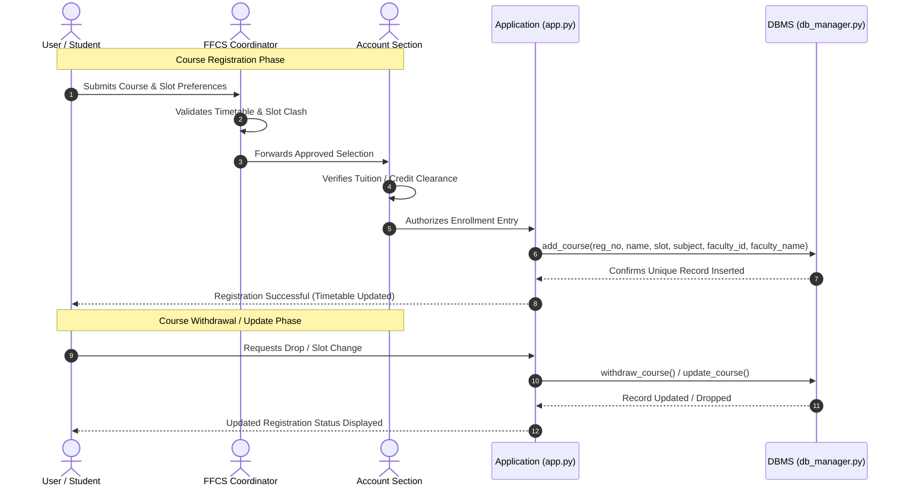
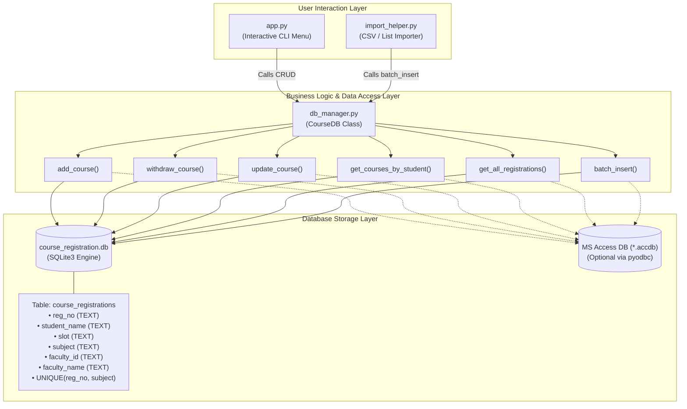
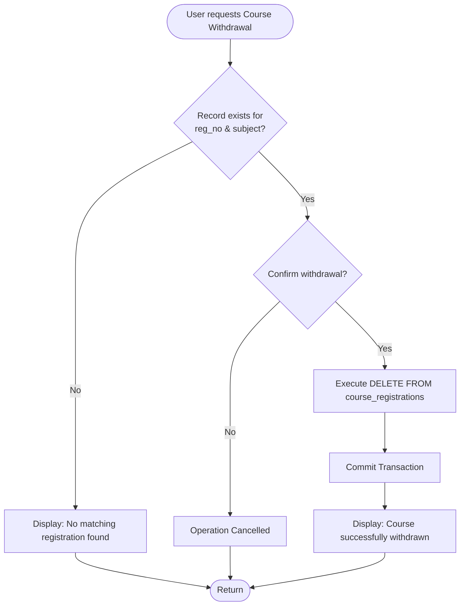
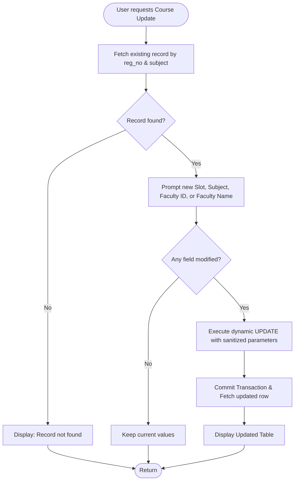

# System Architecture & Workflow Diagrams

This document details the complete end-to-end architecture and operational flow of the **Student Course Registration DBMS** (based on the FFCS model).

---

## 1. Visual Workflow Architecture


---

## 2. User & Administrative Workflow (Whiteboard Flow)

The system reflects the 3 core actors and approval flow:
- **User / Student**: Selects courses, requests additions, updates, and withdrawals.
- **FFCS Coordinator**: Verifies slot clash free allocation (e.g. A1, B1), credit limits, and faculty workloads.
- **Account Section**: Validates fee status, authorizes credit registration, and commits enrollment.



---

## 3. Application Component Architecture



---

## 4. Operation Flowcharts

### A. Add Course Flow
```mermaid
flowchart TD
    Start([User Inputs Course Details]) --> InputCheck{Are all 6 fields<br/>provided?}
    InputCheck -- No --> ErrorFields[Show validation error] --> End([Return])
    InputCheck -- Yes --> CheckDup{Does (reg_no, subject)<br/>already exist?}
    CheckDup -- Yes --> ErrorDup[Raise Unique Constraint Error:<br/>Student already enrolled in this course] --> End
    CheckDup -- No --> InsertSQL[Execute INSERT INTO course_registrations]
    InsertSQL --> Commit[Commit Transaction]
    Commit --> Success[Display Success & Updated Table] --> End
```

### B. Withdraw Course Flow


### C. Update Course Flow

